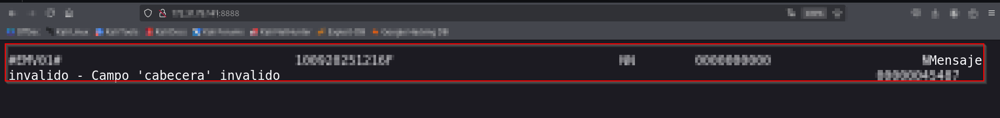

# Dataphone A920 — Incorrect Access Control (Redacted)

## Overview

This document summarizes an access-control issue observed in the Dataphone A920 (build v2025.07.161103). A network-facing service is exposed by default on the local network without authentication. The issue allows unauthenticated interaction with the device's service interface and may reveal implementation details in error responses.

This README provides a high-level description of the issue, impact, recommended mitigations, and responsible-disclosure guidance. It intentionally omits exploit code, detailed interaction steps, or other low-level instructions to prevent misuse.

## Vulnerability summary (high level)

A service on the device is reachable over the local network and does not require authentication for TCP-layer connections. Unauthenticated clients can open a socket to the service and exchange data with it. In addition, certain HTTP requests to the service elicit error responses that disclose functional behavior, protocol identifiers used by the vendor, and the device build version.

Because the service processes unauthenticated input and returns informative error messages, an attacker on the same network may gain knowledge about the device’s internals and interact with the exposed service interface without credentials.

## Key security weaknesses

* Service exposed by default on the local network with no authentication or access controls.
* Sensitive implementation details (including protocol identifiers and build metadata) are revealed in error responses.
* Insufficient hardening of the service interface to reject unauthenticated or unexpected requests.
* Lack of network-level restrictions (e.g., firewall rules, interface binding) that would limit access to trusted hosts.

## Impact

**Scope of access:** Unauthenticated interaction with the device's exposed service process.

**Potential consequences:**

* Unauthorized discovery and enumeration of device functionality and versions.
* Interaction with the service that may allow manipulation of the exposed interface or unintended invocation of service functionality.
* Greater ease for attackers to develop targeted attacks against the device given exposed diagnostic or identifying information.

A formal severity and impact determination should be made following vendor analysis to clarify whether the issue affects only the service context or can lead to broader system compromise.

## Proof-of-concept (high level)

During testing, an unauthenticated TCP connection to the service was accepted and simple requests provoked error responses that contained:

* Identifiers used by the device’s packet/protocol implementation.
* The device build version (reported in the response).

This behavior demonstrates two important issues: the service accepts unauthenticated connections

The publicly posted report does not include raw screenshots or packet captures. Instead, sanitized images are referenced below so a vendor-facing report can contain visual evidence without exposing identifying or sensitive data.

1. Network scan summary

2. Browser interaction
